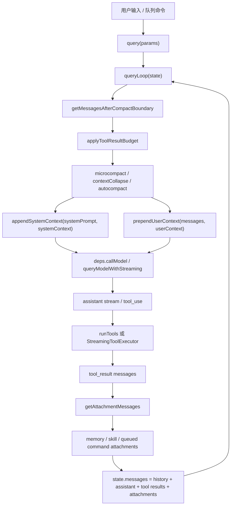

# 上下文工程阅读文档

本文聚焦这个恢复版 Claude Code 源码树里“给模型看什么、什么时候看、超出窗口怎么办、工具结果如何回灌”的上下文工程链路。

## 一、核心结论

上下文不是在一个函数里一次性拼出来的，而是一条流水线：

1. 系统提示词由 [`src/constants/prompts.ts`](https://github.com/jackone666/cc-study/blob/main/src/constants/prompts.ts) 和 [`src/constants/systemPromptSections.ts`](https://github.com/jackone666/cc-study/blob/main/src/constants/systemPromptSections.ts) 分段生成，并用动态边界区分可缓存前缀和每轮动态内容。
2. 会话级动态上下文由 [`src/context.ts`](https://github.com/jackone666/cc-study/blob/main/src/context.ts) 读取，例如 git 状态、CLAUDE.md/MEMORY.md、当前日期。
3. 每轮请求进入 [`src/query.ts`](https://github.com/jackone666/cc-study/blob/main/src/query.ts)，先裁剪/压缩历史，再把系统上下文追加到 system prompt，把用户上下文插入为 meta user message。
4. API 层由 [`src/utils/api.ts`](https://github.com/jackone666/cc-study/blob/main/src/utils/api.ts) 和 [`src/services/api/claude.ts`](https://github.com/jackone666/cc-study/blob/main/src/services/api/claude.ts) 转换 system prompt、messages、tools，并设置 prompt cache。
5. 模型产生 tool_use 后，[`src/query.ts`](https://github.com/jackone666/cc-study/blob/main/src/query.ts) 执行工具，把 tool_result、附件、记忆和技能发现结果追加进下一轮消息，形成 agentic loop。
6. 当 token 接近窗口上限时，[`src/services/compact/`](https://github.com/jackone666/cc-study/blob/main/src/services/compact/)、[`src/services/contextCollapse/`](https://github.com/jackone666/cc-study/blob/main/src/services/contextCollapse/)、[`src/utils/toolResultStorage.ts`](https://github.com/jackone666/cc-study/blob/main/src/utils/toolResultStorage.ts) 负责降载、摘要或恢复。

## 二、先理解原理

Claude Code 的上下文工程可以理解成一个“请求装配器”。用户看到的是一轮对话，但真正发给模型的是多层材料拼成的请求：固定规则、动态环境、历史消息、工具定义、附件、记忆、压缩摘要。代码的核心工作就是在每一轮请求前决定这些材料的取舍和顺序。

### 1. 为什么要分层

不同信息的稳定性不一样。系统规则、工具使用原则、输出风格这类内容相对稳定，适合放在 system prompt，并尽量利用 prompt cache。当前日期、git 状态、CLAUDE.md、用户项目记忆、IDE 选区、刚执行完的工具结果都是动态信息，不能简单塞进同一个大字符串里，否则会带来三个问题：

1. 缓存命中率下降：每轮动态内容变化都会让整个系统提示词前缀变化。
2. 上下文窗口浪费：低价值或重复内容会挤掉真正需要的历史和工具结果。
3. 行为边界混乱：长期规则、临时提醒、工具输出、用户输入如果没有分层，模型更难判断优先级。

所以这个项目把上下文拆成几类：system prompt 管长期行为，system context 管系统侧动态补充，user context 管项目规则和记忆，messages 管对话历史，attachments 管本轮额外材料，tools 管可执行能力。

### 2. 一轮请求如何组装

每轮请求从 [`queryLoop()`](https://github.com/jackone666/cc-study/blob/main/src/query.ts#L234) 开始。它不会直接把完整历史丢给模型，而是先做一次“上下文整理”：

1. 从当前 `state.messages` 取出压缩边界之后的有效历史。
2. 对过大的工具结果做预算控制，必要时替换成较短引用。
3. 执行 microcompact、context collapse、autocompact 等窗口管理策略。
4. 把 `systemContext` 追加到 system prompt 尾部。
5. 把 `userContext` 包成 meta user message 放到 messages 最前。
6. 调用模型，流式接收 assistant message 和 tool_use。
7. 如果有 tool_use，就执行工具，把 tool_result、附件、记忆召回结果加入消息历史，再进入下一次循环。

这就是 agentic loop 的本质：模型不是一次回答到底，而是在“模型请求 -> 工具执行 -> 工具结果回灌 -> 再请求模型”之间循环，直到没有新的 tool_use 或达到限制。

### 3. system prompt 和 user context 的区别

system prompt 是模型行为的最高层规则，例如怎么工作、如何使用工具、哪些安全边界要遵守。它通过 [`src/constants/prompts.ts`](https://github.com/jackone666/cc-study/blob/main/src/constants/prompts.ts) 组织，最终由 [`buildSystemPromptBlocks()`](https://github.com/jackone666/cc-study/blob/main/src/services/api/claude.ts#L3250) 转成 API 的 system text blocks。

user context 虽然对模型也很重要，但它不是 system prompt。比如 CLAUDE.md、MEMORY.md、当前日期会通过 [`prependUserContext()`](https://github.com/jackone666/cc-study/blob/main/src/utils/api.ts#L438) 包成 `<system-reminder>`，作为 meta user message 放在消息数组前面。这样做的好处是：项目规则和记忆能被模型看到，但不会污染系统提示词缓存边界。

### 4. prompt cache 的核心思路

缓存的关键是“稳定前缀”。[`SYSTEM_PROMPT_DYNAMIC_BOUNDARY`](https://github.com/jackone666/cc-study/blob/main/src/constants/prompts.ts#L111) 把系统提示词切成静态段和动态段。[`splitSysPromptPrefix()`](https://github.com/jackone666/cc-study/blob/main/src/utils/api.ts#L289) 根据这个边界决定哪些 block 可以使用 `global` 或 `org` 级缓存，哪些 block 不能缓存。

读这部分代码时要注意两个方向：

1. 稳定内容尽量靠前，复用缓存，降低重复请求成本。
2. 用户/会话相关内容必须放在边界之后或 user context 中，避免被错误缓存。

### 5. 工具调用为什么会改变上下文

工具调用不是旁路执行，它会变成下一次模型请求的上下文。模型返回 `tool_use` 后，代码会调用 `runTools(...)` 或 `StreamingToolExecutor` 执行工具，然后生成对应的 `tool_result` message。下一轮 `state.messages` 会包含原历史、assistant 的 tool_use、工具结果和新附件。

这有两个重要后果：

1. 工具输出太大时必须控量，否则一次 `Read` 或 `Bash` 结果就能吞掉窗口。
2. tool_use 和 tool_result 必须严格配对，否则 API 会拒绝后续请求。

### 6. 压缩不是简单截断

上下文压缩不是把旧消息直接删掉，而是尽量把旧历史转成摘要，同时保留当前任务仍需要的近期消息、附件和 hook 结果。传统压缩路径在 [`compactConversation()`](https://github.com/jackone666/cc-study/blob/main/src/services/compact/compact.ts#L368) 中生成摘要，再由 [`buildPostCompactMessages()`](https://github.com/jackone666/cc-study/blob/main/src/services/compact/compact.ts#L308) 重建消息数组。

自动压缩由 [`shouldAutoCompact()`](https://github.com/jackone666/cc-study/blob/main/src/services/compact/autoCompact.ts#L178) 判断阈值，由 [`autoCompactIfNeeded()`](https://github.com/jackone666/cc-study/blob/main/src/services/compact/autoCompact.ts#L245) 执行。它会先尝试 session memory compact，再退回传统摘要 compact。这样设计是为了尽量减少信息损失，同时保证请求不会超过模型窗口。

### 7. 记忆召回为什么异步预取

记忆系统不把所有记忆都塞进上下文，而是先扫描记忆文件头，再用小模型挑选和当前 query 最相关的少量文件。这个选择过程在 [`startRelevantMemoryPrefetch()`](https://github.com/jackone666/cc-study/blob/main/src/utils/attachments.ts#L2365) 里提前启动，底层用 [`findRelevantMemories()`](https://github.com/jackone666/cc-study/blob/main/src/memdir/findRelevantMemories.ts#L38) 挑选。

这样做有两个收益：

1. 节省上下文：只注入可能相关的记忆，而不是全量注入。
2. 节省等待：预取和主模型/工具执行并行，主循环后面只消费已经完成的结果。

### 8. 阅读代码时的主线

看代码时可以一直追这个问题：某段信息是从哪里来的，以什么身份进入模型，又在什么时候被移除、压缩或复用缓存？

建议带着下面四个变量看：

1. `systemPrompt`：长期行为规则。
2. `systemContext`：系统侧动态补充，例如 git 快照。
3. `userContext`：项目规则、CLAUDE.md/MEMORY.md、日期。
4. `messagesForQuery`：真正准备送进模型的历史和工具回合。

如果你能在 [`queryLoop()`](https://github.com/jackone666/cc-study/blob/main/src/query.ts#L234) 里跟住这四个变量，这个项目的上下文工程基本就串起来了。

## 三、按调用顺序阅读

### 快速跳转

| 主题 | 入口 |
| --- | --- |
| 每轮主循环 | [`query()`](https://github.com/jackone666/cc-study/blob/main/src/query.ts#L204)、[`queryLoop()`](https://github.com/jackone666/cc-study/blob/main/src/query.ts#L234) |
| 生产依赖映射 | [`productionDeps()`](https://github.com/jackone666/cc-study/blob/main/src/query/deps.ts#L28) |
| 系统/用户动态上下文 | [`getSystemContext()`](https://github.com/jackone666/cc-study/blob/main/src/context.ts#L118)、[`getUserContext()`](https://github.com/jackone666/cc-study/blob/main/src/context.ts#L159) |
| 系统提示词缓存分块 | [`splitSysPromptPrefix()`](https://github.com/jackone666/cc-study/blob/main/src/utils/api.ts#L289)、[`buildSystemPromptBlocks()`](https://github.com/jackone666/cc-study/blob/main/src/services/api/claude.ts#L3250) |
| 上下文注入 API 请求 | [`appendSystemContext()`](https://github.com/jackone666/cc-study/blob/main/src/utils/api.ts#L415)、[`prependUserContext()`](https://github.com/jackone666/cc-study/blob/main/src/utils/api.ts#L438) |
| 流式模型请求 | [`queryModelWithStreaming()`](https://github.com/jackone666/cc-study/blob/main/src/services/api/claude.ts#L775) |
| 自动压缩判断与执行 | [`calculateTokenWarningState()`](https://github.com/jackone666/cc-study/blob/main/src/services/compact/autoCompact.ts#L102)、[`shouldAutoCompact()`](https://github.com/jackone666/cc-study/blob/main/src/services/compact/autoCompact.ts#L178)、[`autoCompactIfNeeded()`](https://github.com/jackone666/cc-study/blob/main/src/services/compact/autoCompact.ts#L245) |
| 压缩摘要与重建 | [`buildPostCompactMessages()`](https://github.com/jackone666/cc-study/blob/main/src/services/compact/compact.ts#L308)、[`compactConversation()`](https://github.com/jackone666/cc-study/blob/main/src/services/compact/compact.ts#L368) |
| 附件注入 | [`getAttachmentMessages()`](https://github.com/jackone666/cc-study/blob/main/src/utils/attachments.ts#L2942) |
| 相关记忆召回 | [`findRelevantMemories()`](https://github.com/jackone666/cc-study/blob/main/src/memdir/findRelevantMemories.ts#L38)、[`startRelevantMemoryPrefetch()`](https://github.com/jackone666/cc-study/blob/main/src/utils/attachments.ts#L2365)、[`filterDuplicateMemoryAttachments()`](https://github.com/jackone666/cc-study/blob/main/src/utils/attachments.ts#L2510) |

### 1. 入口和每轮主循环

这一段建议按下面的调用顺序看。它是主线，后面所有功能点都会回到这里。

1. [`query(params)`](https://github.com/jackone666/cc-study/blob/main/src/query.ts#L204)：外层 async generator，负责启动主循环，并在主循环正常结束后标记已消费命令完成。
2. [`queryLoop(params, consumedCommandUuids)`](https://github.com/jackone666/cc-study/blob/main/src/query.ts#L234)：真正的 agentic loop，内部用 `while (true)` 承载“模型请求 -> 工具执行 -> 继续请求”的循环。
3. [`startRelevantMemoryPrefetch(...)`](https://github.com/jackone666/cc-study/blob/main/src/utils/attachments.ts#L2365)：在每个用户轮次开始时预取相关记忆，后面工具回合结束再消费，避免阻塞主请求。
4. [`getMessagesAfterCompactBoundary(messages)`](https://github.com/jackone666/cc-study/blob/main/src/utils/messages.ts#L4654)：丢弃压缩边界之前的旧历史，只保留当前有效上下文。
5. [`applyToolResultBudget(...)`](https://github.com/jackone666/cc-study/blob/main/src/utils/toolResultStorage.ts#L925)：先处理过大的工具结果，避免单条 `tool_result` 占满上下文窗口。
6. [`deps.microcompact(...)`](https://github.com/jackone666/cc-study/blob/main/src/query.ts#L375) -> [`microcompactMessages(...)`](https://github.com/jackone666/cc-study/blob/main/src/services/compact/microCompact.ts#L259)：执行局部微压缩，删除或替换可以安全缩短的历史片段。
7. [`contextCollapse.applyCollapsesIfNeeded(...)`](https://github.com/jackone666/cc-study/blob/main/src/services/contextCollapse/index.ts#L46)：如果 context collapse 功能开启，在 autocompact 前先做更细粒度的折叠投影。
8. [`appendSystemContext(systemPrompt, systemContext)`](https://github.com/jackone666/cc-study/blob/main/src/utils/api.ts#L415)：把系统侧动态上下文追加到 system prompt 尾部。
9. [`deps.autocompact(...)`](https://github.com/jackone666/cc-study/blob/main/src/query.ts#L402) -> [`autoCompactIfNeeded(...)`](https://github.com/jackone666/cc-study/blob/main/src/services/compact/autoCompact.ts#L245)：检查是否需要摘要压缩；如果触发，会返回新的压缩后消息数组。
10. [`buildPostCompactMessages(compactionResult)`](https://github.com/jackone666/cc-study/blob/main/src/services/compact/compact.ts#L308)：把压缩边界、摘要、保留消息、附件和 hook 结果按固定顺序拼回消息历史。
11. [`calculateTokenWarningState(...)`](https://github.com/jackone666/cc-study/blob/main/src/services/compact/autoCompact.ts#L102)：在真正请求模型前做阻塞阈值检查，防止明显超过窗口的请求继续发送。
12. [`prependUserContext(messagesForQuery, userContext)`](https://github.com/jackone666/cc-study/blob/main/src/utils/api.ts#L438)：把 CLAUDE.md、MEMORY.md、日期等用户上下文包装成 meta user message，放到消息数组最前。
13. [`deps.callModel(...)`](https://github.com/jackone666/cc-study/blob/main/src/query.ts#L607) -> [`queryModelWithStreaming(...)`](https://github.com/jackone666/cc-study/blob/main/src/services/api/claude.ts#L775)：发起主模型请求并接收流式事件。
14. [`runTools(...)`](https://github.com/jackone666/cc-study/blob/main/src/query.ts#L1330)：如果模型返回 `tool_use`，执行对应工具并生成 `tool_result`。
15. [`getAttachmentMessages(...)`](https://github.com/jackone666/cc-study/blob/main/src/utils/attachments.ts#L2942)：工具执行后补充 IDE、文件变更、任务、队列命令等附件上下文。
16. [`filterDuplicateMemoryAttachments(...)`](https://github.com/jackone666/cc-study/blob/main/src/utils/attachments.ts#L2510)：消费第 3 步的记忆预取结果，并过滤已经被读写过的记忆。
17. [`state = next`](https://github.com/jackone666/cc-study/blob/main/src/query.ts#L1645)：把本轮 assistant、tool_result、attachments 合并成下一轮 `messages`，回到第 2 步继续循环。

### 2. 系统提示词和动态上下文

系统提示词和动态上下文分两条线：一条产出 system prompt，一条产出每轮动态 context。

1. [`getSystemPrompt(...)`](https://github.com/jackone666/cc-study/blob/main/src/constants/prompts.ts#L455)：系统提示词总入口，收集静态规则、工具规则、输出风格、模型/环境说明等片段。
2. [`systemPromptSection(...)`](https://github.com/jackone666/cc-study/blob/main/src/constants/systemPromptSections.ts#L23)：声明可缓存系统提示词片段，适合稳定内容。
3. [`DANGEROUS_uncachedSystemPromptSection(...)`](https://github.com/jackone666/cc-study/blob/main/src/constants/systemPromptSections.ts#L38)：声明每轮重算片段，只适合确实必须动态变化的内容。
4. [`resolveSystemPromptSections(...)`](https://github.com/jackone666/cc-study/blob/main/src/constants/systemPromptSections.ts#L52)：解析所有片段；可缓存片段命中缓存就不重新计算。
5. [`SYSTEM_PROMPT_DYNAMIC_BOUNDARY`](https://github.com/jackone666/cc-study/blob/main/src/constants/prompts.ts#L111)：插入系统提示词数组中，标记“前面是稳定缓存区，后面是动态区”。
6. [`getSystemContext()`](https://github.com/jackone666/cc-study/blob/main/src/context.ts#L118)：采集 git 快照、调试缓存破坏标记等系统侧动态上下文。
7. [`getUserContext()`](https://github.com/jackone666/cc-study/blob/main/src/context.ts#L159)：采集 CLAUDE.md/MEMORY.md、当前日期等用户侧上下文。
8. [`appendSystemContext(...)`](https://github.com/jackone666/cc-study/blob/main/src/utils/api.ts#L415)：把第 6 步追加到 system prompt 尾部。
9. [`prependUserContext(...)`](https://github.com/jackone666/cc-study/blob/main/src/utils/api.ts#L438)：把第 7 步包装成 `<system-reminder>`，作为 meta user message 放到 messages 最前。

### 3. API 请求成形

API 请求成形是把内部结构转成 Anthropic Messages API 能接受的 payload。

1. [`queryLoop()`](https://github.com/jackone666/cc-study/blob/main/src/query.ts#L234)：准备 `messagesForQuery`、`fullSystemPrompt`、`tools`、`thinkingConfig` 等入参。
2. [`prependUserContext(...)`](https://github.com/jackone666/cc-study/blob/main/src/utils/api.ts#L438)：把用户上下文插入到 API messages 前部。
3. [`queryModelWithStreaming(...)`](https://github.com/jackone666/cc-study/blob/main/src/services/api/claude.ts#L775)：流式请求入口，负责组装 API 参数并转发流式事件。
4. [`normalizeMessagesForAPI(...)`](https://github.com/jackone666/cc-study/blob/main/src/utils/messages.ts#L1999)：把内部 `Message` 转成 API 需要的 user/assistant message，并处理 tool_use/tool_result 配对等细节。
5. [`toolToAPISchema(...)`](https://github.com/jackone666/cc-study/blob/main/src/utils/api.ts#L131)：把内部 Tool 对象转成 API tool schema，包括工具描述、输入 schema、严格模式、缓存控制等。
6. [`splitSysPromptPrefix(...)`](https://github.com/jackone666/cc-study/blob/main/src/utils/api.ts#L289)：按 `SYSTEM_PROMPT_DYNAMIC_BOUNDARY` 拆 system prompt，决定每段是否能用缓存。
7. [`buildSystemPromptBlocks(...)`](https://github.com/jackone666/cc-study/blob/main/src/services/api/claude.ts#L3250)：把第 6 步的分块转成 API `text` block，并设置 `cache_control`。
8. [`queryModelWithoutStreaming(...)`](https://github.com/jackone666/cc-study/blob/main/src/services/api/claude.ts#L721)：非流式请求入口，主要用于小模型 side query、分类、摘要辅助等场景。

### 4. 附件、记忆和额外上下文

附件和记忆不是主 system prompt 的一部分，它们是在每轮工具回合之后补进 messages 的额外上下文。

1. [`startRelevantMemoryPrefetch(...)`](https://github.com/jackone666/cc-study/blob/main/src/utils/attachments.ts#L2365)：在主循环开始时根据用户 query 异步预取相关记忆。
2. [`findRelevantMemories(...)`](https://github.com/jackone666/cc-study/blob/main/src/memdir/findRelevantMemories.ts#L38)：扫描记忆文件头，让小模型挑选最多 5 个相关记忆文件。
3. [`selectRelevantMemories(...)`](https://github.com/jackone666/cc-study/blob/main/src/memdir/findRelevantMemories.ts#L87)：把 query、记忆 manifest、最近使用工具一起发给小模型，让它返回文件名列表。
4. [`getAttachmentMessages(...)`](https://github.com/jackone666/cc-study/blob/main/src/utils/attachments.ts#L2942)：工具执行完后，把 IDE 选区、文件变更、todo、队列命令、任务状态、hook 输出等转成 attachment message。
5. [`filterDuplicateMemoryAttachments(...)`](https://github.com/jackone666/cc-study/blob/main/src/utils/attachments.ts#L2510)：消费第 1 步预取结果前去重，避免重复注入模型已经读过或写过的记忆。
6. [`createAttachmentMessage(...)`](https://github.com/jackone666/cc-study/blob/main/src/utils/attachments.ts#L3212)：把 attachment 数据包装成内部 `AttachmentMessage`，后续随 `toolResults` 一起进入下一轮 `state.messages`。
7. [`loadMemoryPrompt(...)`](https://github.com/jackone666/cc-study/blob/main/src/memdir/memdir.ts#L418)：构建“如何保存/使用文件型记忆”的系统说明；它是记忆规则，不是某次 query 的相关记忆内容。

### 5. 上下文压缩和窗口管理

窗口管理有两个目标：先尽量保留细粒度上下文，真的快超窗时再用摘要替换旧历史。

1. [`applyToolResultBudget(...)`](https://github.com/jackone666/cc-study/blob/main/src/utils/toolResultStorage.ts#L925)：最早执行，先缩短超大工具结果。
2. [`microcompactMessages(...)`](https://github.com/jackone666/cc-study/blob/main/src/services/compact/microCompact.ts#L259)：做局部压缩，通常比整段摘要更少损失信息。
3. [`contextCollapse.applyCollapsesIfNeeded(...)`](https://github.com/jackone666/cc-study/blob/main/src/services/contextCollapse/index.ts#L46)：完整实现中用于更细粒度的上下文折叠；当前恢复树是 no-op shim。
4. [`calculateTokenWarningState(...)`](https://github.com/jackone666/cc-study/blob/main/src/services/compact/autoCompact.ts#L102)：根据 token 使用量计算 warning/error/autocompact/blocking 状态。
5. [`shouldAutoCompact(...)`](https://github.com/jackone666/cc-study/blob/main/src/services/compact/autoCompact.ts#L178)：排除压缩代理递归、reactive-only、context-collapse 接管等场景后，判断是否触发自动压缩。
6. [`autoCompactIfNeeded(...)`](https://github.com/jackone666/cc-study/blob/main/src/services/compact/autoCompact.ts#L245)：自动压缩入口，先尝试 session memory compact，再退回传统摘要 compact。
7. [`compactConversation(...)`](https://github.com/jackone666/cc-study/blob/main/src/services/compact/compact.ts#L368)：传统摘要压缩，用 forked agent 总结旧历史，并收集压缩后仍需保留的附件。
8. [`stripImagesFromMessages(...)`](https://github.com/jackone666/cc-study/blob/main/src/services/compact/compact.ts#L140)：摘要请求前剥离图片/文档块，降低压缩请求本身爆窗的概率。
9. [`buildPostCompactMessages(...)`](https://github.com/jackone666/cc-study/blob/main/src/services/compact/compact.ts#L308)：把压缩结果重建为新的消息历史，顺序是边界、摘要、保留消息、附件、hook 结果。
10. [`queryLoop()`](https://github.com/jackone666/cc-study/blob/main/src/query.ts#L234)：收到压缩结果后替换 `messagesForQuery`，继续当前请求或进入下一轮。

## 四、主调用关系

## 五、一次请求里的上下文层次

| 层次 | 代码位置 | 注入方式 | 作用 |
| --- | --- | --- | --- |
| 静态系统提示词 | [`src/constants/prompts.ts`](https://github.com/jackone666/cc-study/blob/main/src/constants/prompts.ts) | system prompt | 定义 agent 身份、工具规则、任务行为 |
| 动态系统上下文 | [`src/context.ts`](https://github.com/jackone666/cc-study/blob/main/src/context.ts) + `appendSystemContext()` | system prompt 尾部 | git 快照、调试注入等 |
| 用户上下文 | [`src/context.ts`](https://github.com/jackone666/cc-study/blob/main/src/context.ts) + `prependUserContext()` | meta user message | CLAUDE.md、MEMORY.md、当前日期 |
| 历史消息 | [`src/query.ts`](https://github.com/jackone666/cc-study/blob/main/src/query.ts) | messages | 用户/助手/工具回合历史 |
| 工具 schema | [`src/utils/api.ts`](https://github.com/jackone666/cc-study/blob/main/src/utils/api.ts) | tools | 告诉模型当前可调用工具及参数结构 |
| 附件 | [`src/utils/attachments.ts`](https://github.com/jackone666/cc-study/blob/main/src/utils/attachments.ts) | attachment message | 文件变更、IDE 上下文、任务通知、记忆召回 |
| 压缩摘要 | [`src/services/compact/compact.ts`](https://github.com/jackone666/cc-study/blob/main/src/services/compact/compact.ts) | compact summary message | 替代过长旧历史 |

## 六、关键设计点

### 系统提示词缓存

`SYSTEM_PROMPT_DYNAMIC_BOUNDARY` 是阅读系统提示词的关键。`splitSysPromptPrefix()` 会把边界前的稳定内容作为更适合缓存的块，边界后的动态内容不走全局缓存。这样可以让“产品规则和工具规则”稳定复用，又避免把用户目录、git 状态这类动态信息错误缓存到全局。

看代码时先找 [`SYSTEM_PROMPT_DYNAMIC_BOUNDARY`](https://github.com/jackone666/cc-study/blob/main/src/constants/prompts.ts#L111) 被插入的位置，再看 [`splitSysPromptPrefix()`](https://github.com/jackone666/cc-study/blob/main/src/utils/api.ts#L289) 如何扫描数组。这里最重要的是顺序：边界前后的顺序决定缓存策略，不能只看字符串内容。

### CLAUDE.md / MEMORY.md 注入

`getUserContext()` 通过 `getMemoryFiles()` 和 `getClaudeMds()` 读取规则文件，然后 `prependUserContext()` 把它们包装成 `<system-reminder>`。这意味着这些内容在 API 里是 user message，不是 system prompt，但它们被放在消息历史最前，模型每轮都能看到。

看代码时重点关注 [`getUserContext()`](https://github.com/jackone666/cc-study/blob/main/src/context.ts#L159) 里的关闭条件：环境变量可以硬关闭 CLAUDE.md，bare 模式会跳过自动发现，但仍尊重显式 add-dir。然后再看 [`prependUserContext()`](https://github.com/jackone666/cc-study/blob/main/src/utils/api.ts#L438) 如何把这些内容包装成 meta message。

### 工具结果回灌

`queryLoop()` 收到 `tool_use` 后不会结束整轮，而是执行工具、生成 `tool_result`，再把它们加入 `state.messages` 进入下一次循环。这样模型能基于工具结果继续推理。代码里特别注意 tool_use/tool_result 配对，因为 Anthropic API 要求每个 tool_use 都有对应 tool_result。

看代码时可以从 [`runTools(...)`](https://github.com/jackone666/cc-study/blob/main/src/query.ts#L1330) 往后读，直到构造 `next: State` 的位置。你会看到工具结果、附件、记忆召回结果被合并进下一轮消息，这就是为什么工具执行结果会影响后续推理。

### 自动压缩

自动压缩有三层：

1. `applyToolResultBudget()`：先处理单条工具结果过大的问题。
2. `microcompact` / `snip`：删除或替换局部历史。
3. `autoCompactIfNeeded()`：超过阈值后生成摘要，替换旧历史。

压缩后的消息顺序由 `buildPostCompactMessages()` 固定：边界消息、摘要消息、保留消息、附件、hook 结果。

看代码时不要只看 `compactConversation()`。真正决定“该不该压缩”的是 [`calculateTokenWarningState()`](https://github.com/jackone666/cc-study/blob/main/src/services/compact/autoCompact.ts#L102) 和 [`shouldAutoCompact()`](https://github.com/jackone666/cc-study/blob/main/src/services/compact/autoCompact.ts#L178)；真正决定“压缩后历史长什么样”的是 [`buildPostCompactMessages()`](https://github.com/jackone666/cc-study/blob/main/src/services/compact/compact.ts#L308)。

### 相关记忆召回

记忆不是每轮都全量展开。`startRelevantMemoryPrefetch()` 在 query 开始时异步启动，底层 `findRelevantMemories()` 扫描记忆头信息，再让小模型最多选择 5 个相关文件。主循环在工具结果处理后消费预取结果，能减少等待，也避免重复注入模型已经读过的记忆。

看代码时要区分“记忆系统提示词”和“相关记忆内容”。[`memdir.ts`](https://github.com/jackone666/cc-study/blob/main/src/memdir/memdir.ts) 更偏向告诉模型如何保存/使用记忆；[`findRelevantMemories()`](https://github.com/jackone666/cc-study/blob/main/src/memdir/findRelevantMemories.ts#L38) 则是在当前 query 下挑选要临时注入的记忆文件。

## 七、调试建议

1. 想看“为什么模型看到了某段规则”：从 `getUserContext()`、`prependUserContext()` 和 `getAttachmentMessages()` 查起。
2. 想看“为什么压缩了”：查 `calculateTokenWarningState()`、`shouldAutoCompact()` 和 `autoCompactIfNeeded()`。
3. 想看“为什么缓存没命中”：查 `SYSTEM_PROMPT_DYNAMIC_BOUNDARY`、`splitSysPromptPrefix()`、`buildSystemPromptBlocks()`。
4. 想看“工具结果为什么进入下一轮”：查 `queryLoop()` 里 `runTools(...)` 后构造 `next: State` 的位置。
5. 想看“记忆为什么被召回”：查 `startRelevantMemoryPrefetch()`、`findRelevantMemories()` 和 `filterDuplicateMemoryAttachments()`。
