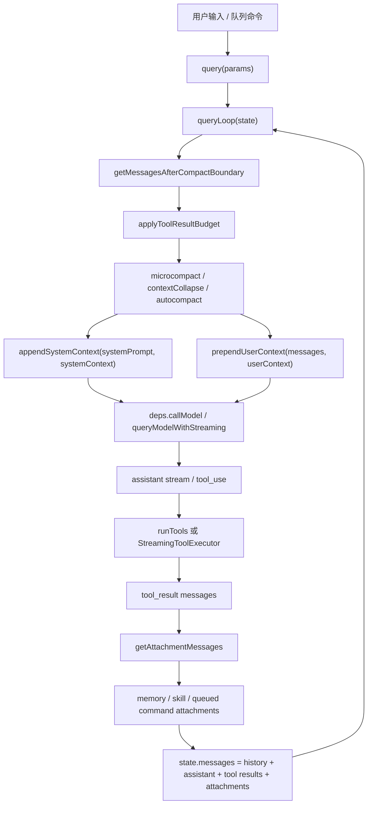

# 上下文工程阅读文档

本文聚焦这个恢复版 Claude Code 源码树里“给模型看什么、什么时候看、超出窗口怎么办、工具结果如何回灌”的上下文工程链路。

## 一、核心结论

上下文不是在一个函数里一次性拼出来的，而是一条流水线：

1. 系统提示词由 [`src/constants/prompts.ts`](https://github.com/jackone666/cc-study/blob/main/src/constants/prompts.ts) 和 [`src/constants/systemPromptSections.ts`](https://github.com/jackone666/cc-study/blob/main/src/constants/systemPromptSections.ts) 分段生成，并用动态边界区分可缓存前缀和每轮动态内容。
2. 会话级动态上下文由 [`src/context.ts`](https://github.com/jackone666/cc-study/blob/main/src/context.ts) 读取，例如 git 状态、CLAUDE.md/MEMORY.md、当前日期。
3. 每轮请求进入 [`src/query.ts`](https://github.com/jackone666/cc-study/blob/main/src/query.ts)，先裁剪/压缩历史，再把系统上下文追加到 system prompt，把用户上下文插入为 meta user message。
4. API 层由 [`src/utils/api.ts`](https://github.com/jackone666/cc-study/blob/main/src/utils/api.ts) 和 [`src/services/api/claude.ts`](https://github.com/jackone666/cc-study/blob/main/src/services/api/claude.ts) 转换 system prompt、messages、tools，并设置 prompt cache。
5. 模型产生 tool_use 后，[`src/query.ts`](https://github.com/jackone666/cc-study/blob/main/src/query.ts) 执行工具，把 tool_result、附件、记忆和技能发现结果追加进下一轮消息，形成 agentic loop。
6. 当 token 接近窗口上限时，[`src/services/compact/`](https://github.com/jackone666/cc-study/blob/main/src/services/compact/)、[`src/services/contextCollapse/`](https://github.com/jackone666/cc-study/blob/main/src/services/contextCollapse/)、[`src/utils/toolResultStorage.ts`](https://github.com/jackone666/cc-study/blob/main/src/utils/toolResultStorage.ts) 负责降载、摘要或恢复。

## 二、先理解原理

Claude Code 的上下文工程可以理解成一个“请求装配器”。用户看到的是一轮对话，但真正发给模型的是多层材料拼成的请求：固定规则、动态环境、历史消息、工具定义、附件、记忆、压缩摘要。代码的核心工作就是在每一轮请求前决定这些材料的取舍和顺序。

### 1. 为什么要分层

不同信息的稳定性不一样。系统规则、工具使用原则、输出风格这类内容相对稳定，适合放在 system prompt，并尽量利用 prompt cache。当前日期、git 状态、CLAUDE.md、用户项目记忆、IDE 选区、刚执行完的工具结果都是动态信息，不能简单塞进同一个大字符串里，否则会带来三个问题：

1. 缓存命中率下降：每轮动态内容变化都会让整个系统提示词前缀变化。
2. 上下文窗口浪费：低价值或重复内容会挤掉真正需要的历史和工具结果。
3. 行为边界混乱：长期规则、临时提醒、工具输出、用户输入如果没有分层，模型更难判断优先级。

所以这个项目把上下文拆成几类：system prompt 管长期行为，system context 管系统侧动态补充，user context 管项目规则和记忆，messages 管对话历史，attachments 管本轮额外材料，tools 管可执行能力。

### 2. 一轮请求如何组装

每轮请求从 [`queryLoop()`](https://github.com/jackone666/cc-study/blob/main/src/query.ts#L234) 开始。它不会直接把完整历史丢给模型，而是先做一次“上下文整理”：

1. 从当前 `state.messages` 取出压缩边界之后的有效历史。
2. 对过大的工具结果做预算控制，必要时替换成较短引用。
3. 执行 microcompact、context collapse、autocompact 等窗口管理策略。
4. 把 `systemContext` 追加到 system prompt 尾部。
5. 把 `userContext` 包成 meta user message 放到 messages 最前。
6. 调用模型，流式接收 assistant message 和 tool_use。
7. 如果有 tool_use，就执行工具，把 tool_result、附件、记忆召回结果加入消息历史，再进入下一次循环。

这就是 agentic loop 的本质：模型不是一次回答到底，而是在“模型请求 -> 工具执行 -> 工具结果回灌 -> 再请求模型”之间循环，直到没有新的 tool_use 或达到限制。

### 3. system prompt 和 user context 的区别

system prompt 是模型行为的最高层规则，例如怎么工作、如何使用工具、哪些安全边界要遵守。它通过 [`src/constants/prompts.ts`](https://github.com/jackone666/cc-study/blob/main/src/constants/prompts.ts) 组织，最终由 [`buildSystemPromptBlocks()`](https://github.com/jackone666/cc-study/blob/main/src/services/api/claude.ts#L3250) 转成 API 的 system text blocks。

user context 虽然对模型也很重要，但它不是 system prompt。比如 CLAUDE.md、MEMORY.md、当前日期会通过 [`prependUserContext()`](https://github.com/jackone666/cc-study/blob/main/src/utils/api.ts#L438) 包成 `<system-reminder>`，作为 meta user message 放在消息数组前面。这样做的好处是：项目规则和记忆能被模型看到，但不会污染系统提示词缓存边界。

### 4. prompt cache 的核心思路

缓存的关键是“稳定前缀”。[`SYSTEM_PROMPT_DYNAMIC_BOUNDARY`](https://github.com/jackone666/cc-study/blob/main/src/constants/prompts.ts#L111) 把系统提示词切成静态段和动态段。[`splitSysPromptPrefix()`](https://github.com/jackone666/cc-study/blob/main/src/utils/api.ts#L289) 根据这个边界决定哪些 block 可以使用 `global` 或 `org` 级缓存，哪些 block 不能缓存。

读这部分代码时要注意两个方向：

1. 稳定内容尽量靠前，复用缓存，降低重复请求成本。
2. 用户/会话相关内容必须放在边界之后或 user context 中，避免被错误缓存。

### 5. 工具调用为什么会改变上下文

工具调用不是旁路执行，它会变成下一次模型请求的上下文。模型返回 `tool_use` 后，代码会调用 `runTools(...)` 或 `StreamingToolExecutor` 执行工具，然后生成对应的 `tool_result` message。下一轮 `state.messages` 会包含原历史、assistant 的 tool_use、工具结果和新附件。

这有两个重要后果：

1. 工具输出太大时必须控量，否则一次 `Read` 或 `Bash` 结果就能吞掉窗口。
2. tool_use 和 tool_result 必须严格配对，否则 API 会拒绝后续请求。

### 6. 压缩不是简单截断

上下文压缩不是把旧消息直接删掉，而是尽量把旧历史转成摘要，同时保留当前任务仍需要的近期消息、附件和 hook 结果。传统压缩路径在 [`compactConversation()`](https://github.com/jackone666/cc-study/blob/main/src/services/compact/compact.ts#L368) 中生成摘要，再由 [`buildPostCompactMessages()`](https://github.com/jackone666/cc-study/blob/main/src/services/compact/compact.ts#L308) 重建消息数组。

自动压缩由 [`shouldAutoCompact()`](https://github.com/jackone666/cc-study/blob/main/src/services/compact/autoCompact.ts#L178) 判断阈值，由 [`autoCompactIfNeeded()`](https://github.com/jackone666/cc-study/blob/main/src/services/compact/autoCompact.ts#L245) 执行。它会先尝试 session memory compact，再退回传统摘要 compact。这样设计是为了尽量减少信息损失，同时保证请求不会超过模型窗口。

### 7. 记忆召回为什么异步预取

记忆系统不把所有记忆都塞进上下文，而是先扫描记忆文件头，再用小模型挑选和当前 query 最相关的少量文件。这个选择过程在 [`startRelevantMemoryPrefetch()`](https://github.com/jackone666/cc-study/blob/main/src/utils/attachments.ts#L2365) 里提前启动，底层用 [`findRelevantMemories()`](https://github.com/jackone666/cc-study/blob/main/src/memdir/findRelevantMemories.ts#L38) 挑选。

这样做有两个收益：

1. 节省上下文：只注入可能相关的记忆，而不是全量注入。
2. 节省等待：预取和主模型/工具执行并行，主循环后面只消费已经完成的结果。

### 8. 阅读代码时的主线

看代码时可以一直追这个问题：某段信息是从哪里来的，以什么身份进入模型，又在什么时候被移除、压缩或复用缓存？

建议带着下面四个变量看：

1. `systemPrompt`：长期行为规则。
2. `systemContext`：系统侧动态补充，例如 git 快照。
3. `userContext`：项目规则、CLAUDE.md/MEMORY.md、日期。
4. `messagesForQuery`：真正准备送进模型的历史和工具回合。

如果你能在 [`queryLoop()`](https://github.com/jackone666/cc-study/blob/main/src/query.ts#L234) 里跟住这四个变量，这个项目的上下文工程基本就串起来了。

## 三、按调用顺序阅读

### 快速跳转

| 主题 | 入口 |
| --- | --- |
| 每轮主循环 | [`query()`](https://github.com/jackone666/cc-study/blob/main/src/query.ts#L204)、[`queryLoop()`](https://github.com/jackone666/cc-study/blob/main/src/query.ts#L234) |
| 生产依赖映射 | [`productionDeps()`](https://github.com/jackone666/cc-study/blob/main/src/query/deps.ts#L28) |
| 系统/用户动态上下文 | [`getSystemContext()`](https://github.com/jackone666/cc-study/blob/main/src/context.ts#L118)、[`getUserContext()`](https://github.com/jackone666/cc-study/blob/main/src/context.ts#L159) |
| 系统提示词缓存分块 | [`splitSysPromptPrefix()`](https://github.com/jackone666/cc-study/blob/main/src/utils/api.ts#L289)、[`buildSystemPromptBlocks()`](https://github.com/jackone666/cc-study/blob/main/src/services/api/claude.ts#L3250) |
| 上下文注入 API 请求 | [`appendSystemContext()`](https://github.com/jackone666/cc-study/blob/main/src/utils/api.ts#L415)、[`prependUserContext()`](https://github.com/jackone666/cc-study/blob/main/src/utils/api.ts#L438) |
| 流式模型请求 | [`queryModelWithStreaming()`](https://github.com/jackone666/cc-study/blob/main/src/services/api/claude.ts#L775) |
| 自动压缩判断与执行 | [`calculateTokenWarningState()`](https://github.com/jackone666/cc-study/blob/main/src/services/compact/autoCompact.ts#L102)、[`shouldAutoCompact()`](https://github.com/jackone666/cc-study/blob/main/src/services/compact/autoCompact.ts#L178)、[`autoCompactIfNeeded()`](https://github.com/jackone666/cc-study/blob/main/src/services/compact/autoCompact.ts#L245) |
| 压缩摘要与重建 | [`buildPostCompactMessages()`](https://github.com/jackone666/cc-study/blob/main/src/services/compact/compact.ts#L308)、[`compactConversation()`](https://github.com/jackone666/cc-study/blob/main/src/services/compact/compact.ts#L368) |
| 附件注入 | [`getAttachmentMessages()`](https://github.com/jackone666/cc-study/blob/main/src/utils/attachments.ts#L2942) |
| 相关记忆召回 | [`findRelevantMemories()`](https://github.com/jackone666/cc-study/blob/main/src/memdir/findRelevantMemories.ts#L38)、[`startRelevantMemoryPrefetch()`](https://github.com/jackone666/cc-study/blob/main/src/utils/attachments.ts#L2365)、[`filterDuplicateMemoryAttachments()`](https://github.com/jackone666/cc-study/blob/main/src/utils/attachments.ts#L2510) |

### 1. 入口和每轮主循环

这一段建议按下面的调用顺序看。它是主线，后面所有功能点都会回到这里。

1. [`query(params)`](https://github.com/jackone666/cc-study/blob/main/src/query.ts#L204)
   这是对外暴露的 async generator 壳层。它接收调用方准备好的 `QueryParams`，创建 `consumedCommandUuids` 用来记录本轮消费过的队列命令，然后把执行权交给 `queryLoop()`。`queryLoop()` 正常结束后，它再把这些队列命令标记为 completed；如果中途异常或被外部取消，就不会误标完成。读这个函数时重点看它如何把生命周期收尾和真正循环拆开。

2. [`queryLoop(params, consumedCommandUuids)`](https://github.com/jackone666/cc-study/blob/main/src/query.ts#L234)
   这是主循环本体。它先从 `params` 中取出 system prompt、user context、system context、工具权限、模型配置等稳定入参，再创建可变的 `state`，把消息历史、工具上下文、turn 计数、压缩追踪状态都放进去。之后进入 `while (true)`：每轮都重新整理 `messagesForQuery`，再调用模型；如果模型产生 `tool_use`，就执行工具并把结果写回 `state`，然后继续下一轮；如果模型不再要工具或达到终止条件，就返回 terminal。

3. [`startRelevantMemoryPrefetch(...)`](https://github.com/jackone666/cc-study/blob/main/src/utils/attachments.ts#L2365)
   主循环一开始就启动记忆预取，但它不阻塞当前模型请求。它会从消息历史中找到最近一条真实用户输入，跳过 `<system-reminder>` 这类 meta user message；如果输入太短、记忆功能关闭、或者本会话已经注入太多记忆，就直接返回 `undefined`。成功启动时，它返回一个可 dispose 的 `MemoryPrefetch` 句柄，里面挂着异步检索 promise，后面工具执行结束后再消费。

4. [`getMessagesAfterCompactBoundary(messages)`](https://github.com/jackone666/cc-study/blob/main/src/utils/messages.ts#L4654)
   这个函数负责确定“当前有效历史从哪里开始”。它从后往前找最近的 compact boundary；如果找到了，就从边界位置开始切片，丢弃更早的旧历史；如果没有边界，就保留全部消息。开启 HISTORY_SNIP 时，它还会应用 snip 投影，把已经被历史截断功能隐藏的消息过滤掉。输出就是后面预算控制、微压缩、自动压缩共同操作的基础消息数组。

5. [`applyToolResultBudget(...)`](https://github.com/jackone666/cc-study/blob/main/src/utils/toolResultStorage.ts#L925)
   这一步先处理“单条工具结果太大”的问题。它接收当前消息、内容替换状态和可选 transcript 写入回调；如果预算功能没开，原样返回。开启时，它会扫描工具结果，把过大的内容替换成较短的引用或占位，并把新替换记录交给回调持久化。这样后续压缩和模型请求面对的是已经降载过的消息，避免一个巨大 `tool_result` 直接吃满上下文。

6. [`deps.microcompact(...)`](https://github.com/jackone666/cc-study/blob/main/src/query.ts#L375) -> [`microcompactMessages(...)`](https://github.com/jackone666/cc-study/blob/main/src/services/compact/microCompact.ts#L259)
   `deps.microcompact` 是依赖注入入口，生产环境映射到 `microcompactMessages()`。它做的是局部压缩：优先判断是否满足基于时间的清理条件，如果服务端缓存已经大概率变冷，就直接清空较旧的可压缩工具结果；如果 cached microcompact 能力可用，则通过 API cache edit 删除旧工具结果，而本地消息保持不变。它的目标不是总结整段历史，而是在进入大压缩前先清掉最容易膨胀、又相对可恢复的工具输出。

7. [`contextCollapse.applyCollapsesIfNeeded(...)`](https://github.com/jackone666/cc-study/blob/main/src/services/contextCollapse/index.ts#L46)
   这是 context collapse 的插槽。当前恢复树里它是 no-op shim，只返回原 messages 和 `changed: false`；完整实现里它应该在 autocompact 前做更细粒度的折叠投影，例如把可折叠历史换成更省 token 的表示。它放在这里的意义是：先尝试结构化折叠，再走传统摘要压缩，尽量减少信息损失。

8. [`appendSystemContext(systemPrompt, systemContext)`](https://github.com/jackone666/cc-study/blob/main/src/utils/api.ts#L415)
   这一步把系统侧动态上下文追加到 system prompt 尾部。`systemContext` 是键值字典，例如 git 状态、缓存破坏标记等；函数会把它格式化成 `key: value` 多行文本，再拼到 `systemPrompt` 数组最后。它不插到前面，是为了保持 system prompt 前缀稳定，让 prompt cache 更容易命中。

9. [`deps.autocompact(...)`](https://github.com/jackone666/cc-study/blob/main/src/query.ts#L402) -> [`autoCompactIfNeeded(...)`](https://github.com/jackone666/cc-study/blob/main/src/services/compact/autoCompact.ts#L245)
   自动压缩入口会先判断当前来源是否允许压缩，比如 compact 代理本身不能递归触发压缩，context-collapse 管理窗口时也会跳过。然后它估算 token，和当前模型的自动压缩阈值比较；如果没超阈值，返回 `wasCompacted: false`。如果超了，会先尝试 session memory compact；失败或不可用时退回传统 `compactConversation()`，最终返回 `CompactionResult`。

10. [`buildPostCompactMessages(compactionResult)`](https://github.com/jackone666/cc-study/blob/main/src/services/compact/compact.ts#L308)
    压缩成功后不能只拿摘要替换全部历史，因为还要保留边界、近期消息、附件和 hook 结果。这个函数把 `CompactionResult` 按固定顺序重建为新消息历史：compact boundary、summary messages、messagesToKeep、attachments、hookResults。这个顺序很关键，后续 `getMessagesAfterCompactBoundary()` 会依赖 boundary 找到新历史起点。

11. [`calculateTokenWarningState(...)`](https://github.com/jackone666/cc-study/blob/main/src/services/compact/autoCompact.ts#L102)
    这一步计算当前 token 状态，不直接修改消息。它根据模型上下文窗口、自动压缩阈值、warning/error buffer 算出 `percentLeft`，以及是否进入 warning、error、autocompact、blocking 四个状态。主循环用它决定是否展示警告、是否阻止继续请求，以及压缩后是否仍然太大。

12. [`prependUserContext(messagesForQuery, userContext)`](https://github.com/jackone666/cc-study/blob/main/src/utils/api.ts#L438)
    这一步把用户侧动态上下文放到 API messages 最前面。`userContext` 包含 CLAUDE.md、MEMORY.md、日期等内容；函数会把它们包装成一个 `isMeta` 的 user message，内容用 `<system-reminder>` 包起来。它不是 system prompt，所以不会破坏 system prompt 缓存边界，但模型每轮都能在消息历史开头看到这些项目规则。

13. [`deps.callModel(...)`](https://github.com/jackone666/cc-study/blob/main/src/query.ts#L607) -> [`queryModelWithStreaming(...)`](https://github.com/jackone666/cc-study/blob/main/src/services/api/claude.ts#L775)
    主循环把整理好的 `messagesForQuery`、`fullSystemPrompt`、工具列表、thinking 配置交给模型调用。生产环境里 `deps.callModel` 指向 `queryModelWithStreaming()`，它会把请求转成 Anthropic Messages API 需要的结构，并以 async generator 形式不断 yield `request_start`、流式 assistant 内容、tool_use、错误消息等事件。`queryLoop` 一边把事件给 UI，一边收集 assistant 消息和 tool_use。

14. [`runTools(...)`](https://github.com/jackone666/cc-study/blob/main/src/query.ts#L1330)
    如果 assistant 消息里有 `tool_use`，主循环会进入工具执行阶段。`runTools()` 会按权限检查、工具上下文、工具 schema 找到对应工具并执行，收集每个工具的结果，生成符合 API 协议的 `tool_result` user message。这里还会处理工具错误、权限拒绝、并发执行、工具调用摘要等情况。它的输出不是最终回答，而是下一轮模型继续推理的输入。

15. [`getAttachmentMessages(...)`](https://github.com/jackone666/cc-study/blob/main/src/utils/attachments.ts#L2942)
    工具执行后，系统会把“工具结果之外但模型下一轮应该知道的东西”补进上下文。这个 async generator 会聚合 IDE 选区、文件变更、todo 状态、队列命令、hook 输出、技能发现、相关记忆等附件，然后逐条包装成 attachment message yield 出去。它位于 tool_result 之后，是为了让模型在看到工具结果的同时，也看到最新环境变化。

16. [`filterDuplicateMemoryAttachments(...)`](https://github.com/jackone666/cc-study/blob/main/src/utils/attachments.ts#L2510)
    记忆预取结果进入上下文前还要去重。这个函数会检查 relevant_memories 附件里的每个路径，如果文件已经被 Read/Write/Edit 或上一轮记忆附件放进 `readFileState`，就过滤掉；幸存下来的记忆会写入 `readFileState`，防止下一轮重复注入。它避免模型反复看到同一段记忆，也节省上下文窗口。

17. [`state = next`](https://github.com/jackone666/cc-study/blob/main/src/query.ts#L1645)
    本轮结束时，`queryLoop` 会把旧 `state.messages`、本轮 assistant 消息、工具结果、附件消息组合成 `next`，再赋值回 `state`。这一步就是 agentic loop 的闭环：模型刚刚产生的工具调用和工具结果不会丢，而是成为下一次模型请求的历史上下文。赋值完成后回到循环顶部，重新从压缩边界、预算、上下文注入开始。

### 2. 系统提示词和动态上下文

系统提示词和动态上下文分两条线：一条产出 system prompt，一条产出每轮动态 context。

1. [`getSystemPrompt(...)`](https://github.com/jackone666/cc-study/blob/main/src/constants/prompts.ts#L455)
   这是 system prompt 的总入口。它根据当前工具列表、模型名、额外工作目录、MCP 客户端、输出风格、环境信息等生成多段提示词。它不会直接拼成一个大字符串，而是保留字符串数组形态，方便后续插入缓存边界、按块设置 cache_control。可以把它理解成“模型身份、工具规则、环境规则”的生产工厂。

2. [`systemPromptSection(...)`](https://github.com/jackone666/cc-study/blob/main/src/constants/systemPromptSections.ts#L23)
   这个函数声明一个可缓存的 system prompt 片段。调用方给它一个 `name` 和 `compute` 函数，它返回 `cacheBreak: false` 的 `SystemPromptSection`。后续解析时，如果同名片段已经算过，就可以直接复用缓存，避免稳定规则每轮都重新生成。

3. [`DANGEROUS_uncachedSystemPromptSection(...)`](https://github.com/jackone666/cc-study/blob/main/src/constants/systemPromptSections.ts#L38)
   这个函数声明一个每轮都要重新计算的提示词片段。它也接收 `name` 和 `compute`，但返回 `cacheBreak: true`，表示不能复用旧值。名字里的 `DANGEROUS` 是提醒：这类片段如果放到 prompt cache 前缀里，会让缓存变得不稳定，所以只适合确实会随会话变化的内容。

4. [`resolveSystemPromptSections(...)`](https://github.com/jackone666/cc-study/blob/main/src/constants/systemPromptSections.ts#L52)
   解析器会遍历所有 section：可缓存片段如果缓存命中，就直接返回缓存值；未命中或 `cacheBreak: true` 的片段会调用 `compute()` 重新生成。输出是和输入 section 顺序一致的字符串数组。这个顺序会继续影响 system prompt 的最终顺序，也会影响缓存边界前后内容。

5. [`SYSTEM_PROMPT_DYNAMIC_BOUNDARY`](https://github.com/jackone666/cc-study/blob/main/src/constants/prompts.ts#L111)
   这是一个特殊字符串标记，不是要给模型看的自然语言。`getSystemPrompt()` 会把它插进 system prompt 数组，用来告诉 API 层：边界前面是更稳定的可缓存内容，边界后面是动态内容。后续 `splitSysPromptPrefix()` 会识别并丢弃这个标记，只保留它表达的分界信息。

6. [`getSystemContext()`](https://github.com/jackone666/cc-study/blob/main/src/context.ts#L118)
   这个函数收集系统侧动态上下文，并在会话内 memoize。它会根据远程环境、git 指令开关决定是否读取 git 状态，也会在 break-cache 功能开启时附加缓存破坏标记。返回值是键值字典，不直接进入 messages，而是交给 `appendSystemContext()` 放到 system prompt 尾部。

7. [`getUserContext()`](https://github.com/jackone666/cc-study/blob/main/src/context.ts#L159)
   这个函数收集用户侧动态上下文，也会 memoize。它会判断是否关闭 CLAUDE.md 自动发现，读取 CLAUDE.md/MEMORY.md 等规则文件，并附加当前日期等信息。它还会把 CLAUDE.md 内容同步给自动权限分类器，避免分类器再去读文件造成循环依赖。返回值最终进入 meta user message。

8. [`appendSystemContext(...)`](https://github.com/jackone666/cc-study/blob/main/src/utils/api.ts#L415)
   这一步把第 6 步得到的系统上下文字典格式化成文本，并追加到 system prompt 数组末尾。它保留原 system prompt 主体顺序，不把动态内容塞到前缀里。这样做的结果是：模型仍能看到 git 状态等动态信息，但缓存系统更容易复用稳定前缀。

9. [`prependUserContext(...)`](https://github.com/jackone666/cc-study/blob/main/src/utils/api.ts#L438)
   这一步处理第 7 步的用户上下文。它把每个上下文键值写成 `# key\nvalue`，外层包上 `<system-reminder>`，再创建一个 `isMeta` user message 放到消息数组最前面。模型会把它当作对当前项目的背景提醒，而 API 层仍把它视为普通 user message。

### 3. API 请求成形

API 请求成形是把内部结构转成 Anthropic Messages API 能接受的 payload。

1. [`queryLoop()`](https://github.com/jackone666/cc-study/blob/main/src/query.ts#L234)
   主循环在调用模型前会准备四类核心入参：`messagesForQuery` 是经过边界裁剪、预算控制、压缩处理后的历史；`fullSystemPrompt` 是追加了 system context 的系统提示词；`tools` 是当前轮可用工具；`thinkingConfig` 决定模型是否启用 thinking 以及预算。它还会准备 abort signal、fallback model、skip cache write 等运行参数。

2. [`prependUserContext(...)`](https://github.com/jackone666/cc-study/blob/main/src/utils/api.ts#L438)
   在 API 请求成形阶段，它再次体现为“把用户侧规则变成消息”。输出的第一条消息通常是 meta user message，后面才是用户/助手/工具历史。这样 Anthropic API 看到的 messages 是完整上下文，而 system prompt 仍只承载系统级规则。

3. [`queryModelWithStreaming(...)`](https://github.com/jackone666/cc-study/blob/main/src/services/api/claude.ts#L775)
   这是主模型的流式入口。它接收内部消息、system prompt、thinking 配置、工具列表和请求选项，然后进入 `queryModel()` 的底层请求流程。它会通过 VCR 包装记录/回放流式事件，并把 API 返回的增量持续 yield 给上层。上层不需要等完整回答结束，就能实时处理 assistant 文本、tool_use、错误和用量事件。

4. [`normalizeMessagesForAPI(...)`](https://github.com/jackone666/cc-study/blob/main/src/utils/messages.ts#L1999)
   内部消息类型比 Anthropic API 更丰富，包含 attachment、system boundary、tombstone、virtual message 等。这个函数会先重排附件位置，再移除只用于 UI 的虚拟消息；然后处理 tool_use/tool_result 配对，过滤不可用工具引用，移除因为文件过大或媒体错误而不能再发送的 block。输出只剩 API 能接受的 user/assistant 消息数组。

5. [`toolToAPISchema(...)`](https://github.com/jackone666/cc-study/blob/main/src/utils/api.ts#L131)
   这个函数把内部 Tool 对象变成 API 的 tool schema。它会读取工具名、工具描述、Zod 或 JSON input schema；如果 swarms 功能关闭，会隐藏不该暴露的字段；如果工具和模型都支持 strict structured output，就追加 `strict`；如果开启细粒度工具输入流式，就追加 beta 字段；最后按当前请求需要加上 `cache_control` 或 `defer_loading`。它还用缓存保持工具 schema 稳定，避免 prompt cache 因工具描述反复变化而失效。

6. [`splitSysPromptPrefix(...)`](https://github.com/jackone666/cc-study/blob/main/src/utils/api.ts#L289)
   它把 system prompt 字符串数组拆成若干 `SystemPromptBlock`。如果开启全局缓存且找到 `SYSTEM_PROMPT_DYNAMIC_BOUNDARY`，它会把边界前内容作为 `global` cache block，把边界后内容作为不缓存动态 block；如果因为 MCP 工具需要跳过全局缓存，就改成 `org` cache；默认情况下会把 attribution header、CLI 前缀、剩余提示词拆成较少块。输出里的 `cacheScope` 会直接决定 API 的 `cache_control`。

7. [`buildSystemPromptBlocks(...)`](https://github.com/jackone666/cc-study/blob/main/src/services/api/claude.ts#L3250)
   这个函数接收 `splitSysPromptPrefix()` 的分块结果，把每块转成 Anthropic API 的 `{ type: 'text', text }` block。如果启用了 prompt caching 且该块允许缓存，它会附加 `cache_control`，包括 scope 和 TTL 策略。它是 system prompt 进入 API payload 前的最后一层转换。

8. [`queryModelWithoutStreaming(...)`](https://github.com/jackone666/cc-study/blob/main/src/services/api/claude.ts#L721)
   这是非流式包装入口，但内部仍复用流式 generator。它会消费完整个 `queryModel()` 流，只保留最后的 assistant message 返回。这样 side query、小模型分类、记忆选择、摘要辅助等非交互场景也能共享同一套日志、VCR、错误处理、用量统计逻辑。用户取消时它会抛 `APIUserAbortError`，便于上层区分取消和真实 API 异常。

### 4. 附件、记忆和额外上下文

附件和记忆不是主 system prompt 的一部分，它们是在每轮工具回合之后补进 messages 的额外上下文。

1. [`startRelevantMemoryPrefetch(...)`](https://github.com/jackone666/cc-study/blob/main/src/utils/attachments.ts#L2365)
   这个函数提前启动相关记忆检索。它先确认自动记忆和远程开关都开启，再找到最近一条真实用户输入；如果输入没有足够信息量，或者本会话已展示记忆超过预算，就不启动。启动后它创建子 abort controller，把 query、活跃 agent、readFileState、最近成功工具、已展示记忆路径交给 `getRelevantMemoryAttachments()`。返回句柄会记录耗时和第几轮被消费，方便遥测。

2. [`findRelevantMemories(...)`](https://github.com/jackone666/cc-study/blob/main/src/memdir/findRelevantMemories.ts#L38)
   它负责在记忆目录里找候选文件。第一步扫描记忆文件头，过滤掉已经展示过的路径；第二步调用 `selectRelevantMemories()` 让小模型从 manifest 中挑文件名；第三步把小模型返回的文件名映射回真实扫描结果，只保留合法命中的文件。它返回路径和 mtime，不直接返回内容，避免模型输出任意路径。

3. [`selectRelevantMemories(...)`](https://github.com/jackone666/cc-study/blob/main/src/memdir/findRelevantMemories.ts#L87)
   这个私有函数是“让小模型做选择”的地方。它会把当前 query、记忆 manifest、最近成功工具拼成提示词，让小模型最多返回 5 个文件名。最近成功工具会影响提示：如果某工具已经用得很顺，就降低普通用法文档的召回价值，但仍允许召回踩坑、警告类记忆。返回结果会再经过合法文件名集合过滤。

4. [`getAttachmentMessages(...)`](https://github.com/jackone666/cc-study/blob/main/src/utils/attachments.ts#L2942)
   工具执行结束后，主循环调用它生成额外附件消息。它内部先调用 `getAttachments()` 聚合所有附件来源，包括 IDE 选区、文件改动、todo 提醒、队列命令、hook 输出、后台任务状态、技能发现、记忆召回等。然后它会对附件做排序、去重和过滤，最后逐个 yield `AttachmentMessage`。这些消息会和 tool_result 一起进入下一轮上下文。

5. [`filterDuplicateMemoryAttachments(...)`](https://github.com/jackone666/cc-study/blob/main/src/utils/attachments.ts#L2510)
   相关记忆附件生成后，还要和 `readFileState` 对比。`readFileState` 表示模型已经通过文件读取或记忆注入看过哪些路径；函数会移除已经出现过的记忆，只保留新路径。幸存记忆会立即写入 `readFileState`，保证同一轮后续逻辑也知道它已经进过上下文。若某条 relevant_memories 附件被过滤空，就整条删除。

6. [`createAttachmentMessage(...)`](https://github.com/jackone666/cc-study/blob/main/src/utils/attachments.ts#L3212)
   这是附件数据进入消息系统的包装函数。它给 attachment 加上 `type: 'attachment'`、新 uuid 和 timestamp，形成内部 `AttachmentMessage`。后续 `queryLoop` 把它拼进 `state.messages`，API 发送前再由消息归一化逻辑转换成模型能看到的 user 内容。

7. [`loadMemoryPrompt(...)`](https://github.com/jackone666/cc-study/blob/main/src/memdir/memdir.ts#L418)
   这个函数生成“记忆系统应该怎么使用”的规则提示词，和第 1-6 步的“本轮相关记忆内容”不是一回事。它会根据 auto memory、team memory、KAIROS daily log 等开关选择不同提示词来源：auto + team 时合并规则，仅 auto 时加载单目录规则，auto 关闭时返回 null。它最终进入 system prompt，告诉模型如何保存和使用记忆文件。

### 5. 上下文压缩和窗口管理

窗口管理有两个目标：先尽量保留细粒度上下文，真的快超窗时再用摘要替换旧历史。

1. [`applyToolResultBudget(...)`](https://github.com/jackone666/cc-study/blob/main/src/utils/toolResultStorage.ts#L925)
   这是最早的降载动作，专门处理工具结果膨胀。它不会总结整段对话，只会针对过大的 tool_result 做内容替换，并可把替换记录写入 transcript，方便 resume 后保持一致。它解决的是“局部超大块”的问题。

2. [`microcompactMessages(...)`](https://github.com/jackone666/cc-study/blob/main/src/services/compact/microCompact.ts#L259)
   微压缩比自动摘要更轻。它先检查时间触发路径：如果距离上次主线程 assistant 消息太久，说明服务端缓存可能已经冷了，就清理较旧的可压缩工具结果；再检查 cached microcompact 路径：如果模型和开关支持，就通过 cache edit 让 API 删除旧工具结果。输出可能是原 messages，也可能是已经局部降载的 messages。

3. [`contextCollapse.applyCollapsesIfNeeded(...)`](https://github.com/jackone666/cc-study/blob/main/src/services/contextCollapse/index.ts#L46)
   它代表另一类窗口管理策略：不一定生成摘要，而是把某些上下文折叠成投影。当前恢复树里它不做事，但在完整实现中，它应该在 autocompact 前尝试减少 token。它返回 `{ messages, changed }`，让主循环知道是否需要更新消息历史。

4. [`calculateTokenWarningState(...)`](https://github.com/jackone666/cc-study/blob/main/src/services/compact/autoCompact.ts#L102)
   这个函数把 token 数字变成状态。它根据模型窗口和自动压缩阈值计算剩余百分比，然后判断是否超过 warning buffer、error buffer、autocompact threshold 和 blocking limit。它不关心消息内容，只关心 token 使用量和模型窗口，是 UI 警告和硬阻塞的共同依据。

5. [`shouldAutoCompact(...)`](https://github.com/jackone666/cc-study/blob/main/src/services/compact/autoCompact.ts#L178)
   它是自动压缩的前置判断。先排除不能压缩的来源，比如 `session_memory`、`compact`、context collapse 代理，避免递归或互相抢窗口；再检查用户设置和环境变量是否禁用自动压缩；最后估算 token，扣掉 snip 已释放 token，调用 `calculateTokenWarningState()` 判断是否超过自动压缩阈值。返回 true 才进入真正压缩。

6. [`autoCompactIfNeeded(...)`](https://github.com/jackone666/cc-study/blob/main/src/services/compact/autoCompact.ts#L245)
   这个函数把判断和执行合起来。它会处理连续失败熔断，避免每一轮都重复发起必然失败的压缩；确认需要压缩后，优先走 session memory compact，因为它更可能保留结构化记忆；如果不可用或失败，再调用传统 `compactConversation()`。返回值会告诉主循环是否压缩、压缩结果是什么、连续失败次数如何更新。

7. [`compactConversation(...)`](https://github.com/jackone666/cc-study/blob/main/src/services/compact/compact.ts#L368)
   传统摘要压缩的核心。它先检查消息数量、记录压缩前 token、触发 pre-compact hooks；然后剥离图片/文档、过滤压缩后会重新注入的附件，构造摘要请求。摘要优先通过 forked agent 复用主会话 prompt cache；失败时回退普通流式请求。完成后它收集摘要消息、边界消息、需要保留的近期消息、压缩后附件、hook 结果和 token 统计，形成 `CompactionResult`。

8. [`stripImagesFromMessages(...)`](https://github.com/jackone666/cc-study/blob/main/src/services/compact/compact.ts#L140)
   这是摘要请求前的安全处理。图片和文档块往往很大，但摘要模型多数时候只需要知道“这里曾经有图片/文档”，不需要原始媒体内容。函数会把 user message 里的 image/document 替换成 `[image]`、`[document]` 文本，也会处理 tool_result 内嵌媒体。这样可以降低“压缩请求本身也超窗”的概率。

9. [`buildPostCompactMessages(...)`](https://github.com/jackone666/cc-study/blob/main/src/services/compact/compact.ts#L308)
   压缩结束后，它把 `CompactionResult` 转成真正要写回主循环的消息数组。顺序固定为边界、摘要、保留消息、附件、hook 结果。边界用来告诉后续读取逻辑旧历史已经被摘要替代；摘要承载旧历史；保留消息让模型继续看见最近上下文；附件和 hook 结果补回压缩后仍需要的环境信息。

10. [`queryLoop()`](https://github.com/jackone666/cc-study/blob/main/src/query.ts#L234)
    主循环收到压缩结果后，会用新消息替换本轮 `messagesForQuery` 或更新下一轮 `state.messages`。如果压缩发生在模型调用前，它会继续用压缩后的上下文发请求；如果压缩失败或仍然超窗，则进入错误恢复或阻塞路径。也就是说，压缩不是独立流程，最终一定回到 `queryLoop` 的下一次模型请求。

## 四、主调用关系

## 五、一次请求里的上下文层次

| 层次 | 代码位置 | 注入方式 | 作用 |
| --- | --- | --- | --- |
| 静态系统提示词 | [`src/constants/prompts.ts`](https://github.com/jackone666/cc-study/blob/main/src/constants/prompts.ts) | system prompt | 定义 agent 身份、工具规则、任务行为 |
| 动态系统上下文 | [`src/context.ts`](https://github.com/jackone666/cc-study/blob/main/src/context.ts) + `appendSystemContext()` | system prompt 尾部 | git 快照、调试注入等 |
| 用户上下文 | [`src/context.ts`](https://github.com/jackone666/cc-study/blob/main/src/context.ts) + `prependUserContext()` | meta user message | CLAUDE.md、MEMORY.md、当前日期 |
| 历史消息 | [`src/query.ts`](https://github.com/jackone666/cc-study/blob/main/src/query.ts) | messages | 用户/助手/工具回合历史 |
| 工具 schema | [`src/utils/api.ts`](https://github.com/jackone666/cc-study/blob/main/src/utils/api.ts) | tools | 告诉模型当前可调用工具及参数结构 |
| 附件 | [`src/utils/attachments.ts`](https://github.com/jackone666/cc-study/blob/main/src/utils/attachments.ts) | attachment message | 文件变更、IDE 上下文、任务通知、记忆召回 |
| 压缩摘要 | [`src/services/compact/compact.ts`](https://github.com/jackone666/cc-study/blob/main/src/services/compact/compact.ts) | compact summary message | 替代过长旧历史 |

## 六、关键设计点

### 系统提示词缓存

`SYSTEM_PROMPT_DYNAMIC_BOUNDARY` 是阅读系统提示词的关键。`splitSysPromptPrefix()` 会把边界前的稳定内容作为更适合缓存的块，边界后的动态内容不走全局缓存。这样可以让“产品规则和工具规则”稳定复用，又避免把用户目录、git 状态这类动态信息错误缓存到全局。

看代码时先找 [`SYSTEM_PROMPT_DYNAMIC_BOUNDARY`](https://github.com/jackone666/cc-study/blob/main/src/constants/prompts.ts#L111) 被插入的位置，再看 [`splitSysPromptPrefix()`](https://github.com/jackone666/cc-study/blob/main/src/utils/api.ts#L289) 如何扫描数组。这里最重要的是顺序：边界前后的顺序决定缓存策略，不能只看字符串内容。

### CLAUDE.md / MEMORY.md 注入

`getUserContext()` 通过 `getMemoryFiles()` 和 `getClaudeMds()` 读取规则文件，然后 `prependUserContext()` 把它们包装成 `<system-reminder>`。这意味着这些内容在 API 里是 user message，不是 system prompt，但它们被放在消息历史最前，模型每轮都能看到。

看代码时重点关注 [`getUserContext()`](https://github.com/jackone666/cc-study/blob/main/src/context.ts#L159) 里的关闭条件：环境变量可以硬关闭 CLAUDE.md，bare 模式会跳过自动发现，但仍尊重显式 add-dir。然后再看 [`prependUserContext()`](https://github.com/jackone666/cc-study/blob/main/src/utils/api.ts#L438) 如何把这些内容包装成 meta message。

### 工具结果回灌

`queryLoop()` 收到 `tool_use` 后不会结束整轮，而是执行工具、生成 `tool_result`，再把它们加入 `state.messages` 进入下一次循环。这样模型能基于工具结果继续推理。代码里特别注意 tool_use/tool_result 配对，因为 Anthropic API 要求每个 tool_use 都有对应 tool_result。

看代码时可以从 [`runTools(...)`](https://github.com/jackone666/cc-study/blob/main/src/query.ts#L1330) 往后读，直到构造 `next: State` 的位置。你会看到工具结果、附件、记忆召回结果被合并进下一轮消息，这就是为什么工具执行结果会影响后续推理。

### 自动压缩

自动压缩有三层：

1. `applyToolResultBudget()`：先处理单条工具结果过大的问题。
2. `microcompact` / `snip`：删除或替换局部历史。
3. `autoCompactIfNeeded()`：超过阈值后生成摘要，替换旧历史。

压缩后的消息顺序由 `buildPostCompactMessages()` 固定：边界消息、摘要消息、保留消息、附件、hook 结果。

看代码时不要只看 `compactConversation()`。真正决定“该不该压缩”的是 [`calculateTokenWarningState()`](https://github.com/jackone666/cc-study/blob/main/src/services/compact/autoCompact.ts#L102) 和 [`shouldAutoCompact()`](https://github.com/jackone666/cc-study/blob/main/src/services/compact/autoCompact.ts#L178)；真正决定“压缩后历史长什么样”的是 [`buildPostCompactMessages()`](https://github.com/jackone666/cc-study/blob/main/src/services/compact/compact.ts#L308)。

### 相关记忆召回

记忆不是每轮都全量展开。`startRelevantMemoryPrefetch()` 在 query 开始时异步启动，底层 `findRelevantMemories()` 扫描记忆头信息，再让小模型最多选择 5 个相关文件。主循环在工具结果处理后消费预取结果，能减少等待，也避免重复注入模型已经读过的记忆。

看代码时要区分“记忆系统提示词”和“相关记忆内容”。[`memdir.ts`](https://github.com/jackone666/cc-study/blob/main/src/memdir/memdir.ts) 更偏向告诉模型如何保存/使用记忆；[`findRelevantMemories()`](https://github.com/jackone666/cc-study/blob/main/src/memdir/findRelevantMemories.ts#L38) 则是在当前 query 下挑选要临时注入的记忆文件。

## 七、调试建议

1. 想看“为什么模型看到了某段规则”：从 `getUserContext()`、`prependUserContext()` 和 `getAttachmentMessages()` 查起。
2. 想看“为什么压缩了”：查 `calculateTokenWarningState()`、`shouldAutoCompact()` 和 `autoCompactIfNeeded()`。
3. 想看“为什么缓存没命中”：查 `SYSTEM_PROMPT_DYNAMIC_BOUNDARY`、`splitSysPromptPrefix()`、`buildSystemPromptBlocks()`。
4. 想看“工具结果为什么进入下一轮”：查 `queryLoop()` 里 `runTools(...)` 后构造 `next: State` 的位置。
5. 想看“记忆为什么被召回”：查 `startRelevantMemoryPrefetch()`、`findRelevantMemories()` 和 `filterDuplicateMemoryAttachments()`。
